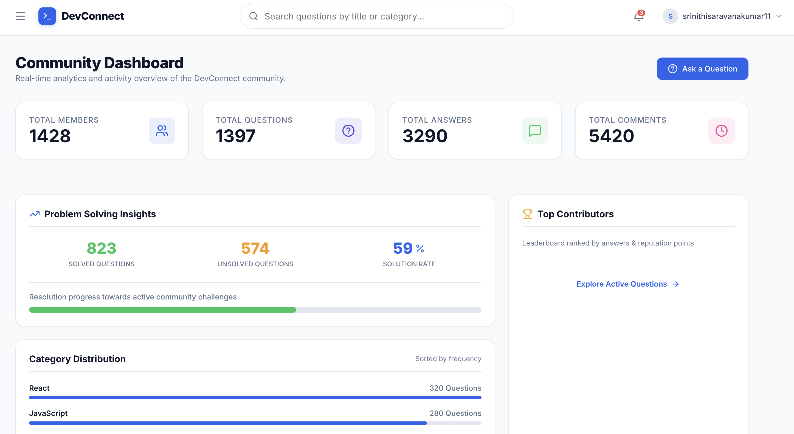
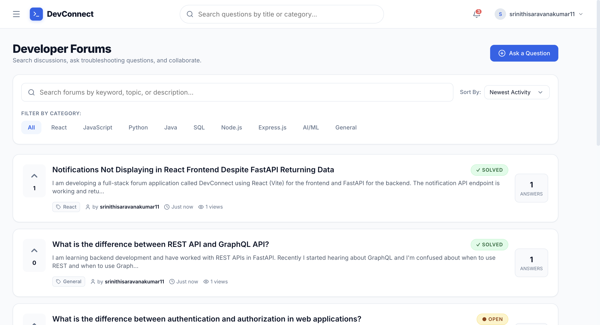
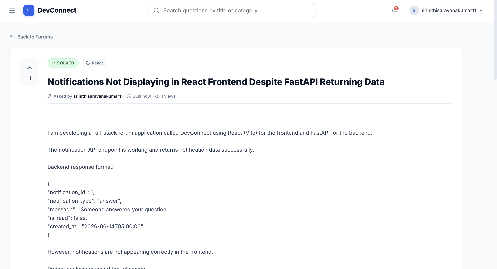
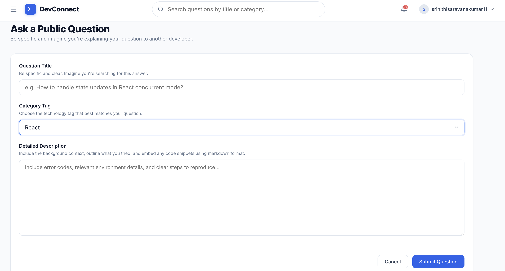
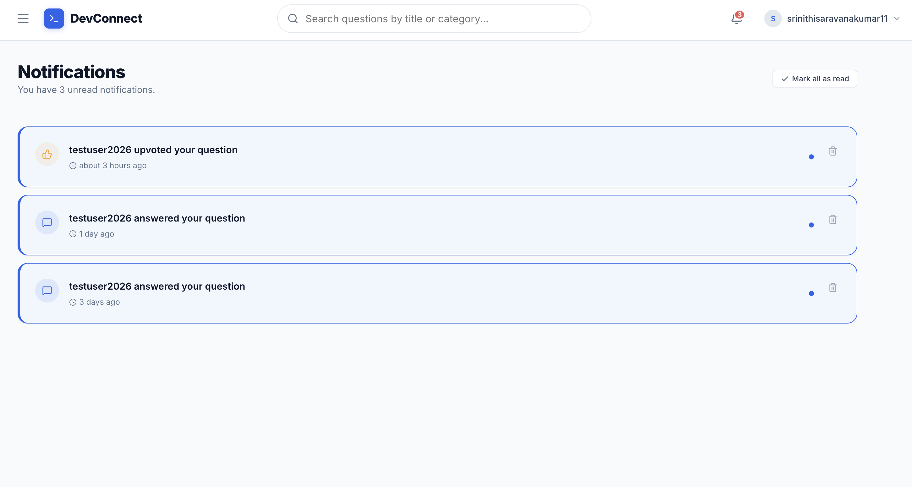
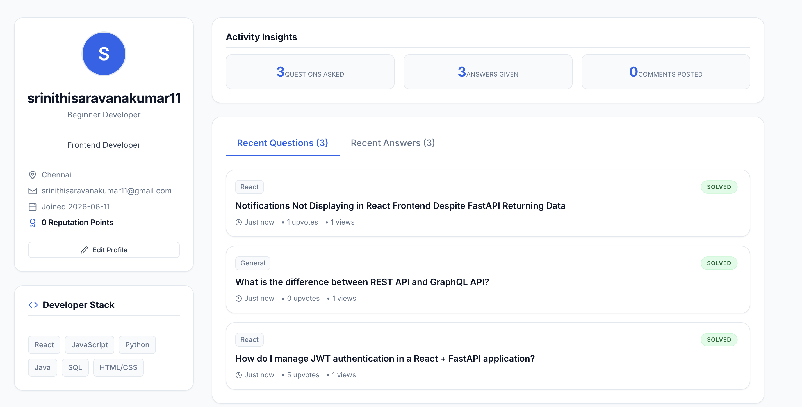

# DevConnect

A full-stack developer discussion forum built using React, FastAPI, and PostgreSQL, enabling developers to ask questions, share knowledge, and collaborate through a modern community platform.

## Features

- JWT-based User Authentication
- User Registration and Login
- Ask Technical Questions
- Post Answers
- Upvote Questions
- Accept Answers
- Notification System
- Question View Tracking
- User Profiles
- RESTful API Architecture
- PostgreSQL Database Integration

## Screenshots

### Login Page

### Dashboard

### Questions Feed

### Question Details

### Ask Question

### Notifications

### User Profile

## Installation

### Clone Repository

git clone https://github.com/srinithisaravanakumar11/DevConnect.git 
cd DevConnect 

### Backend Setup

cd backend  
python -m venv venv  
source venv/bin/activate  
pip install -r requirements.txt  
uvicorn main:app --reload 

Backend will run at:

http://127.0.0.1:8000 

### Frontend Setup

cd frontend  
npm install  
npm run dev 

Frontend will run at:

http://localhost:5173 

---

## Tech Stack

### Frontend
- React
- Vite
- Axios
- React Router

### Backend
- FastAPI
- SQLAlchemy
- JWT Authentication
- Uvicorn

### Database
- PostgreSQL

---

## Project Architecture

React Frontend   
    │     
    ▼  
FastAPI Backend     
    │     
    ▼  
PostgreSQL Database 

---

## Project Structure

DevConnect/ 
├── backend/ 
│   ├── models/ 
│   ├── routes/ 
│   ├── schemas/ 
│   └── main.py 
│ 
├── frontend/ 
│   ├── src/ 
│   ├── public/ 
│   └── package.json 
│ 
├── screenshots/ 
├── README.md 
└── .gitignore 

---

## Future Enhancements

- Real-time notifications using WebSockets
- Comment system
- Question bookmarking
- Search and filtering
- User reputation system
- Deployment on cloud platforms

---

## Author

Srinithi Saravanakumar

Developer | Student | Full-Stack Enthusiast